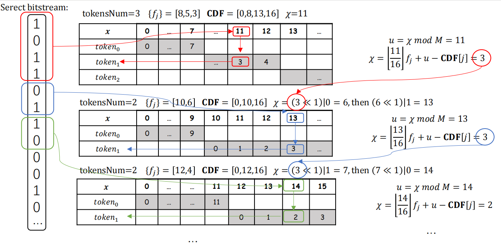

# SAANS Module Documentation

## Overview

`SAANSNEW.py` implements the **Linguistic Steganography via Self-Adjusting Asymmetric Number System (SAANS-Stage)** algorithm. It is designed for efficient binary stream compression with adaptive probability modeling and supports steganographic embedding.

SAANS can act as both a general-purpose entropy coder and a steganographic engine, making it suitable for tasks in data compression, linguistic steganography, and secure communication.

---

## File Location


pythonProject/
└── SAANSNEW.py

---

## SAANS Encoding Process



---

## SAANS Decoding/Extraction Process


## Features

- ✅ Adaptive context-based modeling  
- ✅ Asymmetric coding for higher entropy efficiency  
- ✅ Bit-level stream reconstruction capability  
- ✅ Steganographic bit embedding/extraction  
- ✅ Lightweight, no third-party library required  

---

## Dependencies

- Python 3.6 or higher  
- Pure Python, no external dependencies

---

## How to Use

You can run SAANS directly through the main script:

```bash
# Compression
python run_single.py --mode compress --method saans --input input.txt --output compressed.bin

# Decompression
python run_single.py --mode decompress --method saans --input compressed.bin --output recovered.txt

---


