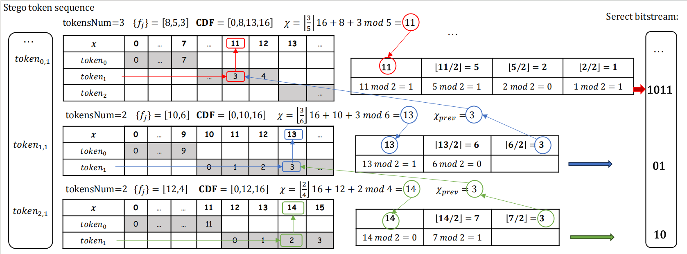

# SAANS Module Documentation

## Overview

`SAANSNEW.py` implements the **Linguistic Steganography via Self-Adjusting Asymmetric Number System (SAANS-Stage)** algorithm, designed for efficient binary stream compression with support for adaptive modeling and potential steganographic embedding.

SAANS can serve as a core compression component or a stego coding method, making it suitable for various applications in data compression, security, and communication.

---

## File Location

pythonProject/
└── SAANSNEW.py

---

## Features

- ✅ Adaptive context-based modeling  
- ✅ Normalized arithmetic coding (AC) for high compression  
- ✅ Supports bitwise stream generation and reconstruction  
- ✅ Can be extended for steganographic data embedding  

---

## Dependencies

- Python 3.6+  
- No external libraries required (pure Python)

---

## How to Use

Command line usage via `run_single.py`:

```bash
# Compression
python run_single.py 

# Decompression
python run_single.py

## SAANS Encoding Process


## SAANS Decoding/Extraction Process




